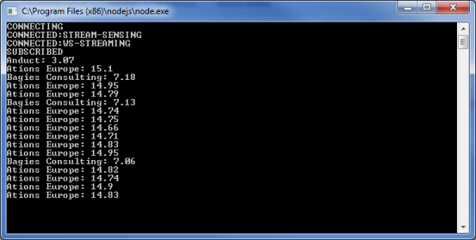

# Lightstreamer - Basic Stock-List Demo - Node.js Client #

<!-- START DESCRIPTION lightstreamer-example-stocklist-client-node -->

This project includes a demo client showing integration between <b>Lightstreamer JavaScript Client Library</b> and the <b>Node.js</b> platform.<br>

<br>

The example provides a very simple version of the [Stock-List Demos](https://github.com/Weswit/Lightstreamer-example-Stocklist-client-javascript) in which only 3 items are subscribed and only the "stock_name" and "last_price" fields are retrieved. The update values are printed on the console.

# Deploy #

In particular, this readme file details the steps required in order to execute the demo calling the node executable from the command line.

## Getting Started ##

Before you can run the demo some dependencies need to be solved:

* Get the lightstreamer_node.js file from the [latest Lightstreamer distribution](http://www.lightstreamer.com/download) and put it in the "src" folder of this project.
* Go to [http://nodejs.org/](http://nodejs.org/) or use the package manager of your OS to download and install the appropriate Node.js server on your system.
  
The Lightstreamer JavaScript Client Library relies on some external modules to run on top of Node.js. Verify that npm was installed correctly together with Node.js (or install it now) and install the following modules:
* npm install requirejs
* npm install xmlhttprequest
* npm install faye-websocket

<!-- END DESCRIPTION lightstreamer-example-stocklist-client-node -->
    
You can now run the included example. From the folder where index.js is simply run one of the following examples of script.
* Windows machines:<br>

```sh
start node index.js
``` 

* Linux machines:<br>

```cmd
#!/bin/sh

node index.js
```

The application is configured to connect to http://localhost:8080. You can modify it to connect to the correct host:port of your Lightstreamer server.

# See Also #

## Lightstreamer Adapters Needed by this Demo Client ##

<!-- START RELATED_ENTRIES -->
* [Lightstreamer - Stock- List Demo - Java Adapter](https://github.com/Weswit/Lightstreamer-example-Stocklist-adapter-java)
* [Lightstreamer - Reusable Metadata Adapters- Java Adapter](https://github.com/Weswit/Lightstreamer-example-ReusableMetadata-adapter-java)

<!-- END RELATED_ENTRIES -->

## Related Projects ##

* [Lightstreamer - Stock-List Demos - HTML Clients](https://github.com/Weswit/Lightstreamer-example-Stocklist-client-javascript)
* [Lightstreamer - Basic Stock-List Demo - jQuery (jqGrid) Client](https://github.com/Weswit/Lightstreamer-example-StockList-client-jquery)
* [Lightstreamer - Stock-List Demo - Dojo Toolkit Client](https://github.com/Weswit/Lightstreamer-example-StockList-client-dojo)
* [Lightstreamer - Basic Stock-List Demo - Java SE (Swing) Client](https://github.com/Weswit/Lightstreamer-example-StockList-client-java)
* [Lightstreamer - Basic Stock-List Demo - .NET Client](https://github.com/Weswit/Lightstreamer-example-StockList-client-dotnet)
* [Lightstreamer - Stock-List Demos - Flex Clients](https://github.com/Weswit/Lightstreamer-example-StockList-client-flex)

# Lightstreamer Compatibility Notes #

- Compatible with Lightstreamer JavaScript Client API v. 6.0 or newer.
