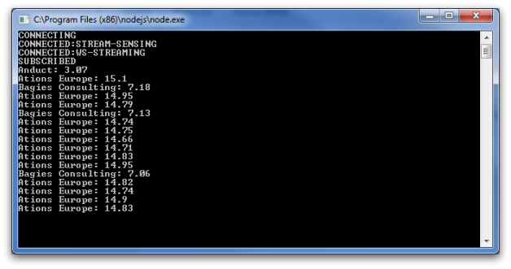

# Lightstreamer - Basic Stock-List Demo - Node.js Client

<!-- START DESCRIPTION lightstreamer-example-stocklist-client-node -->

This project includes a demo client showing integration between <b>Lightstreamer Node.js Client Library</b> and the <b>Node.js</b> platform.<br>

<br>

## Details

The example provides a very simple version of the [Stock-List Demos](https://github.com/Lightstreamer/Lightstreamer-example-Stocklist-client-javascript), in which only 3 items are subscribed and only the "stock_name" and "last_price" fields are retrieved. The update values are printed on the console.

## Install

If you want to install a version of this demo pointing to your local Lightstreamer Server, follow these steps.
In particular, this readme file details the steps required to execute the demo calling the node executable from the command line.

* Note that, as prerequisite, the [Lightstreamer - Stock- List Demo - Java Adapter](https://github.com/Lightstreamer/Lightstreamer-example-Stocklist-adapter-java) has to be deployed on your local Lightstreamer Server instance. Please check out that project and follow the installation instructions provided with it.
* Launch Lightstreamer Server.
* Go to [http://nodejs.org/](http://nodejs.org/) or use the package manager of your OS to download and install the appropriate Node.js server on your system. 
* Get the `lightstreamer-client` package using npm
  * `npm install lightstreamer-client`
  or from the root folder of this project simply run
  * `npm install
  
<!-- END DESCRIPTION lightstreamer-example-stocklist-client-node -->
    
You can now run the included example. From the root folder of this project run 
```sh
node src/index.js
``` 
or
```sh
iojs src/index.js
```

The application is configured to connect to http://localhost:8080. You can modify `src/index.js` to connect to the correct host:port of your Lightstreamer server.

## See Also

### Lightstreamer Adapters Needed by this Demo Client

<!-- START RELATED_ENTRIES -->
* [Lightstreamer - Stock- List Demo - Java Adapter](https://github.com/Lightstreamer/Lightstreamer-example-Stocklist-adapter-java)
* [Lightstreamer - Reusable Metadata Adapters- Java Adapter](https://github.com/Lightstreamer/Lightstreamer-example-ReusableMetadata-adapter-java)

<!-- END RELATED_ENTRIES -->

### Related Projects

* [Lightstreamer - Stock-List Demos - HTML Clients](https://github.com/Lightstreamer/Lightstreamer-example-Stocklist-client-javascript)
* [Lightstreamer - Basic Stock-List Demo - jQuery (jqGrid) Client](https://github.com/Lightstreamer/Lightstreamer-example-StockList-client-jquery)
* [Lightstreamer - Stock-List Demo - Dojo Toolkit Client](https://github.com/Lightstreamer/Lightstreamer-example-StockList-client-dojo)
* [Lightstreamer - Basic Stock-List Demo - Java SE (Swing) Client](https://github.com/Lightstreamer/Lightstreamer-example-StockList-client-java)
* [Lightstreamer - Basic Stock-List Demo - .NET Client](https://github.com/Lightstreamer/Lightstreamer-example-StockList-client-dotnet)
* [Lightstreamer - Stock-List Demos - Flex Clients](https://github.com/Lightstreamer/Lightstreamer-example-StockList-client-flex)

## Lightstreamer Compatibility Notes

* Compatible with Lightstreamer Node.js (formerly JavaScript) Client API v. 6.0 or newer.
